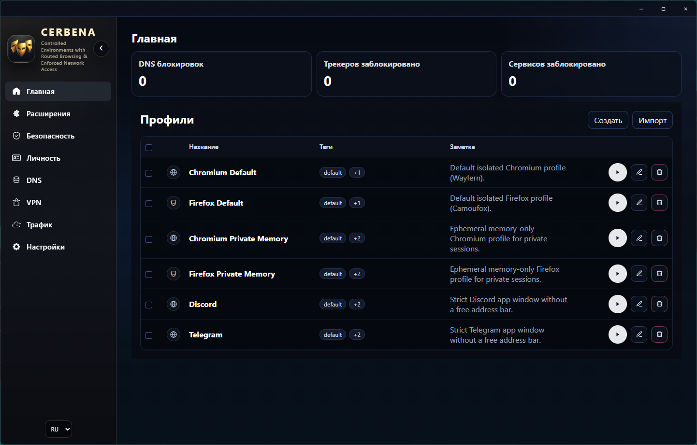
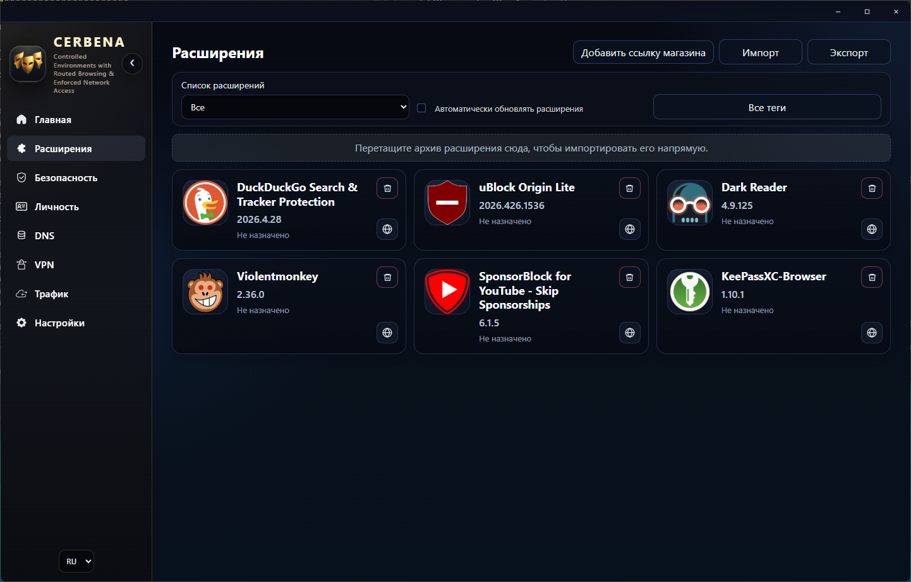
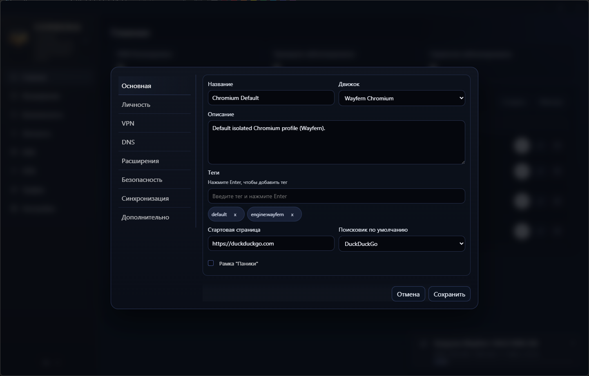
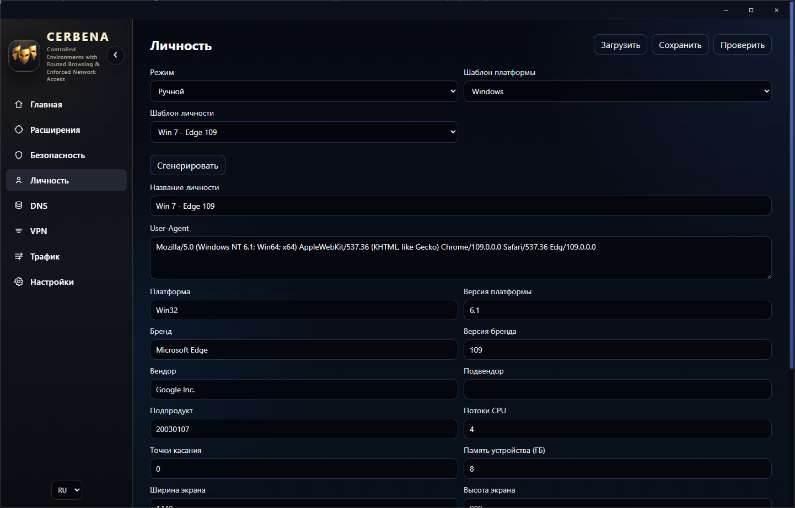
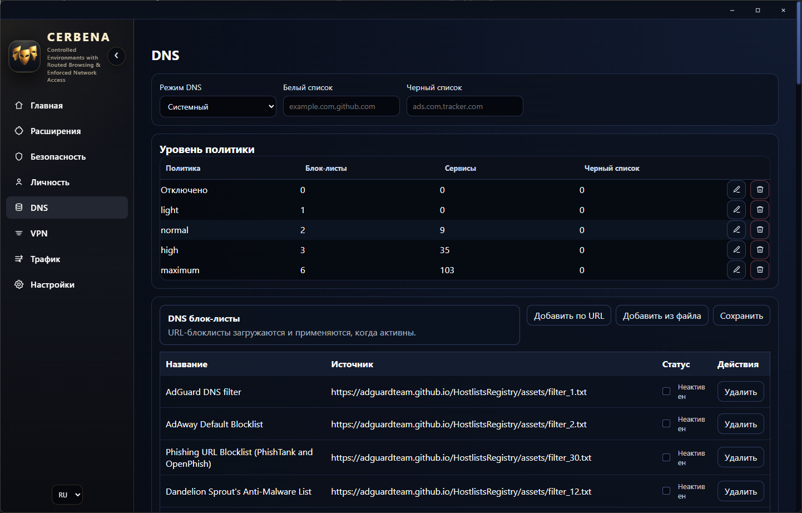
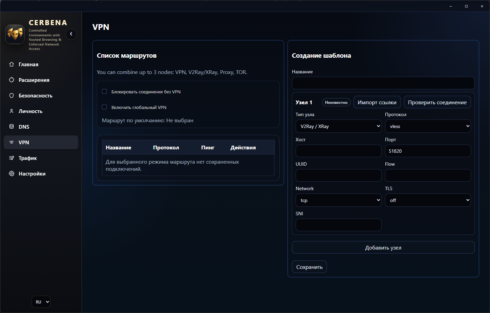

# Berkut Solutions - Cerbena Browser

<p align="center">
  
</p>

[English version](README.en.md)

[GitHub](https://github.com/BerkutSolutions/cerbena-browser)
[Wiki](https://berkutsolutions.github.io/cerbena-browser/)

`Cerbena Browser` - настольная платформа защищенного браузинга с zero-trust-подходом, полной изоляцией профилей, детерминированным policy engine для маршрутизации, DNS и сервисных ограничений, а также управляемой средой запуска для `Wayfern` и `Camoufox`.

## О продукте

Cerbena Browser не является "надстройкой над обычным браузером". Это отдельный launcher и runtime-контур, который управляет:

- изолированными профилями для `Wayfern` и `Camoufox`;
- профильно-специфичными маршрутами `direct` / `proxy` / `vpn` / `tor` / `hybrid`;
- DNS-политиками, blocklists, сервисными ограничениями и черными списками доменов;
- библиотекой расширений, политиками их назначения и автоустановкой в профиль;
- шаблонами личности и полным ручным fingerprint-редактором;
- panic cleanup, пользовательскими сертификатами, локальным API, MCP и audit-контуром;
- зашифрованными sync/backup-сценариями и локальными release/preflight-проверками.

Проект обеспечивает:

- изоляцию профилей по данным, ключам, расширениям, кэшу и сетевой политике;
- зашифрованное хранение чувствительного состояния launcher и настольной оболочки, включая миграцию старых данных в защищенный формат;
- сквозную защиту sync-полезной нагрузки с сохранением обратной совместимости для ранее созданных данных;
- доверенный контур обновления с отдельным `cerbena-updater.exe`, проверкой подписи файла контрольных сумм, сверкой `SHA-256` и безопасной передачей на установку;
- жесткий отказ при небезопасных подобранных DNS-блоклистах и проверку безопасной распаковки архивов сетевого окружения.

## Ключевые возможности

- Полная изоляция профилей: данные, кэш, ключи, расширения и сетевые политики разделены.
- Zero-trust backend enforcement: UI не является границей доверия.
- Kill-switch при обязательном VPN-маршруте.
- Глобальная и профильная DNS-фильтрация с редактируемыми уровнями политики.
- Реалистичные шаблоны личности для Windows, macOS, Linux, iOS и Android.
- Panic frame и экстренная очистка профиля с управляемым retention.
- Библиотека расширений с назначением профилям и автоустановкой по движку.
- Ручные и управляемые release/preflight-скрипты, локальные security/vulnerability gates.
- Windows installer wizard с ярлыками, uninstall-записью и деинсталлятором.
- Отдельный standalone-апдейтер с dry-run preview-режимом и локализованным пошаговым экраном проверки обновления.

## Скриншоты

### Главная



### Расширения



### Профиль



### Личность



### DNS-политики и фильтры



### VPN



## Технологический стек

- Desktop shell: `Tauri 2` + `Rust`
- Frontend: локальный `web UI`
- Workspace: `Cargo` multi-crate
- Документация: `Docusaurus`
- Движки: `Wayfern`, `Camoufox`
- Managed runtime: `sing-box`, `openvpn`, `amneziawg`, `tor`

## Быстрый старт

### Требования

- `Rust` toolchain
- `Node.js` LTS + `npm`
- Windows как основная целевая desktop-платформа

### Проверки

```bash
cargo test --workspace
```

```bash
cd ui/desktop
npm ci
npm test
```

```bash
npm ci
npm run docs:build
```

### Запуск desktop UI

```bash
cd ui/desktop
npm run dev
```

## Release и installer

### Локальный preflight

```powershell
powershell -ExecutionPolicy Bypass -File .\scripts\local-ci-preflight.ps1 -CompactOutput
```

### Release-проверка и упаковка

```powershell
powershell -ExecutionPolicy Bypass -File .\scripts\release.ps1 -Mode package -CompactOutput
```

### Сборка установщика

```powershell
powershell -ExecutionPolicy Bypass -File .\scripts\build-installer.ps1
```

### Что публиковать в GitHub Releases

В GitHub Releases рекомендуется выкладывать:

- `cerbena-browser-setup-<version>.exe` как основной Windows installer;
- при необходимости `cerbena-windows-x64.zip` как переносимый release bundle;
- `cerbena-updater.exe` как отдельный standalone-апдейтер;
- подписанные метаданные релиза и манифест доверенной поставки.

Installer `.exe` собирается локально через `scripts/build-installer.ps1` и предназначен для публикации в релизах как основной способ установки продукта. Точный состав служебных release-файлов зафиксирован в [docs/ru/release-runbook.md](docs/ru/release-runbook.md).

## Документация

- Индекс документации: [docs/README.md](docs/README.md)
- Русская wiki: [docs/ru/README.md](docs/ru/README.md)
- Английская wiki: [docs/eng/README.md](docs/eng/README.md)
- UI и сценарии работы: [docs/ru/core-docs/ui.md](docs/ru/core-docs/ui.md)
- Сеть и маршрутизация: [docs/ru/core-docs/network-routing.md](docs/ru/core-docs/network-routing.md)
- DNS и фильтры: [docs/ru/core-docs/dns-and-filters.md](docs/ru/core-docs/dns-and-filters.md)
- Безопасность: [docs/ru/core-docs/security.md](docs/ru/core-docs/security.md)
- Release runbook: [docs/ru/release-runbook.md](docs/ru/release-runbook.md)

## Полезные файлы

- Вклад разработчиков: [CONTRIBUTING.md](CONTRIBUTING.md)
- Политика безопасности: [SECURITY.md](SECURITY.md)
- Каналы поддержки: [SUPPORT.md](SUPPORT.md)
- История изменений: [CHANGELOG.md](CHANGELOG.md)
